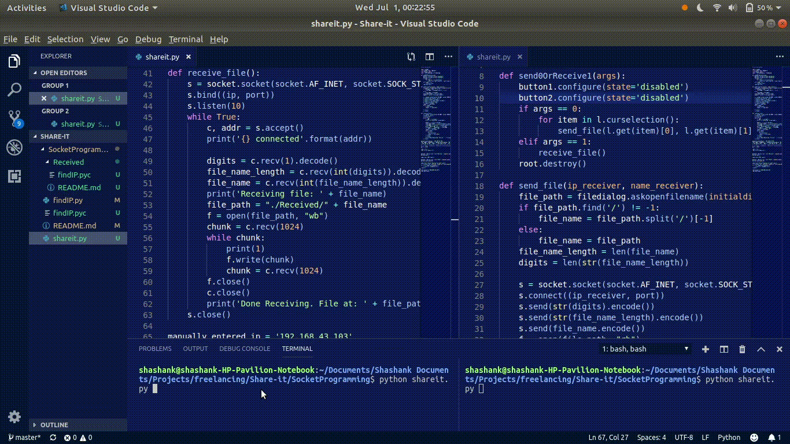

Share-it file transfer using socket functionality

Commands to setup in Linux:

git clone https://github.com/Shashank-Hiremath/Share-it.git
cd Share-it
mkdir Received
sudo apt-get install nmap 
sudo apt install python-pip
pip install python-nmap

Can skip the nmap installation and manually add the ip address of server in the code(line 66)

Commands for quick run

python shareit.py

The program takes few seconds to scan the connected devices.

Current features:
1) Scan nearby devices that are ready to receive
2) GUI for selection of file to be sent
3) GUI to select nearby devices to send selected file

To Do:
1) ~~Change Socket Programming functionality from message sharing to file sharing~~
2) Ensure scalability using memory mapped files
3) Find similar applications and their draw-backs(from github issues)
4) ~~Design an user interface~~
5) ~~Multiple users file sharing~~
6) ~~Scan nearby devices that are ready to receive~~

Possible features:
1) Multiple files or folder transfer
2) Duplicate file_name, modify name
3) Enhance User Interface and User Experience, with async and await